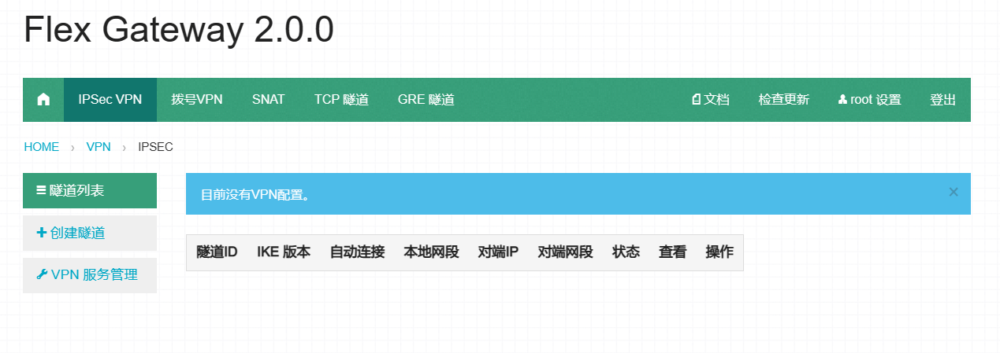

# FlexGW



## 介绍

本程序提供了VPN、SNAT基础服务。

主要提供以下几点功能：

1.  IPSec Site-to-Site功能。可快速的帮助你将两个不同的VPC私网以IPSec Site-to-Site的方式连接起来。
2.  拨号VPN功能。可让你通过拨号方式，接入VPC 私网，进行日常维护管理。
3.  SNAT功能。可方便的设置Source NAT，以让VPC 私网内的VM 通过Gateway VM 访问外网。

## 安装教程
### 设置系统环境

```bash
# 将上面配置的值均设为0，配置文件里没有的，请添加上。
sysctl -a | egrep "ipv4.*(accept|send)_redirects" | awk -F "=" '{print $1"= 0"}'
# sysctl.conf
echo "net.ipv4.ip_forward = 1">>sysctl.conf
# 生效
sysctl -p
```

### 安装软件包

```bash
yum install strongswan openvpn zip curl wget
rpm -ivh flexgw-2.0.0-1.el7.x86_64.rpm
```

### 修改启动端口

修改`vim /usr/local/flexgw/gunicorn.py`中的`443`端口为指定端口。

### 初始化配置

```bash
# 初始化strongswan 配置文件：
cp -fv /usr/local/flexgw/rc/strongswan.conf /etc/strongswan/strongswan.conf
# 初始化openvpn 配置文件：
cp -fv /usr/local/flexgw/rc/openvpn.conf /etc/openvpn/server/server.conf
```

### 设置strongswan

1. 将`/etc/strongswan/strongswan.d/charon/dhcp.conf`配置文件： 注释掉`load = yes`这行。
2. 清空密钥配置文件：`> /etc/strongswan/ipsec.secrets`

### 测试运行strongswan

1. strongswan start
2. strongswan status
3. strongswan stop

### 注意事项

```bash
# 1. 二维码不能生成
/usr/local/flexgw/python/bin/pip install Pillow==4.3.0
service flexgw restart

# 2. 需要安装openssl
安装教程见下方开发说明。
```

### 测试

执行命令：`/etc/init.d/initflexgw`

大约10秒左右，flexgw 就会自动配置好，并启动。启动完毕之后，访问https://公网IP 即可看到登录界面。

测试完毕，请停止服务，并重装flexgw rpm 包：

```bash
/etc/init.d/flexgw stop
rpm -e flexgw-* && rm -rf /usr/local/flexgw/
rpm -ivh flexgw-*.rpm
```

### 制作镜像

1. ln -s /etc/init.d/initflexgw /etc/rc3.d/S98initflexgw
2. 关机。
3. 打快照，制作为镜像。
   此步骤做完之后，请不要再次开机，否则会初始化flexgw 配置文件到镜像里。

### 更新软件

```bash
# 停止flexgw
service flexgw stop
# 在线更新
/usr/local/flexgw/scripts/update --yes
# 手动安装
rpm -Uvh flexgw-xxx.el7.centos.x86_64.rpm
# 启动
service flexgw start
```

## 开发说明

### 升级OpenSSL

```bash
# 查询OpenSSL版本
openssl version
rpm -qa | grep openssl

# 安装新版本OpenSSL
cd /usr/local/src
wget https://github.com.cnpmjs.org/openssl/openssl/archive/OpenSSL_1_1_1c.tar.gz
tar zxvf OpenSSL_1_1_1c.tar.gz
cd openssl-OpenSSL_1_1_1c/
./config --prefix=/usr/local/openssl
make
make install

# 移除老版本
mv /usr/bin/openssl /tmp/
mv /usr/include/openssl /tmp/openssl.bak
ln -s /usr/local/openssl/bin/openssl /usr/bin/openssl
ln -s /usr/local/openssl/include/openssl /usr/include/openssl
 
# 库
echo "/usr/local/openssl/lib/" >> /etc/ld.so.conf
ldconfig
ldd /usr/local/openssl/bin/openssl

# 查询
openssl version
```

### 拉取代码

`cd /usr/local/ && git clone https://github.com/mrjooz/FlexGW.git`

### 开发环境

```bash
# 安装依赖
cd /usr/local/flexgw
python -m pip install --upgrade "pip < 21.0"
pip install -r requirements.txt
# 运行
python develop.py
```

### 打包编译

```bash
# 安装依赖
yum install rpm-build python-pip python-devel zlib-devel bzip2 bzip2-devel readline-devel sqlite sqlite-devel \
openssl-devel xz xz-devel libffi-devel gcc gcc-c++

# 安装python-build
cd /usr/local/src
git clone https://github.com.cnpmjs.org/pyenv/pyenv.git
cd pyenv/plugins/python-build
./install.sh

# 指定OpenSSL（已经在配置文件flexgw.spec中指定）
export CFLAGS="-I/usr/local/openssl/include"
export LDFLAGS="-L/usr/local/openssl/lib"
export LD_LIBRARY_PATH="/usr/local/openssl/lib"

# 打包
cd /usr/local/src/flexgw/packaging/rpm/
sh mkrpm.sh
```

## 使用说明

### ECS VPN（即本程序）

* 目录：/usr/local/flexgw
* 数据库文件：/usr/local/flexgw/instance/website.db
* 日志文件：/usr/local/flexgw/logs/website.log
* 启动脚本：/etc/init.d/flexgw 或/usr/local/flexgw/website_console
* 实用脚本：/usr/local/flexgw/scripts
* 操作命令：service flexgw start/stop/restart

「数据库文件」保存了我们所有的VPN配置，建议定期备份。如果数据库损坏，可通过「实用脚本」目录下的initdb.py脚本对数据库进行初始化，初始化之后所有的配置将清空。

### Strongswan

* 目录：/etc/strongswan
* 日志文件：/var/log/strongswan.charon.log
* 启动脚本：/usr/sbin/strongswan
* 操作命令：strongswan start/status/stop/restart

如果strongswan.conf 配置文件损坏，可使用备份文件/usr/local/flexgw/rc/strongswan.conf 进行覆盖恢复。

ipsec.conf 和ipsec.secrets 配置文件，由/usr/local/flexgw/website/vpn/sts/templates/sts 目录下的同名文件自动生成，请勿随便修改。

### OpenVPN

* 目录：/etc/openvpn
* 日志文件：/etc/openvpn/server/openvpn.log
* 状态文件：/etc/openvpn/server/openvpn-status.log
* 启动脚本：/usr/lib/systemd/system/openvpn-server@.service
* 操作命令：systemctl start/status/stop/restart openvpn-server@server.service

server.conf 配置文件，由/usr/local/flexgw/website/vpn/dial/templates/dial 目录下的同名文件自动生成，请勿随便修改。